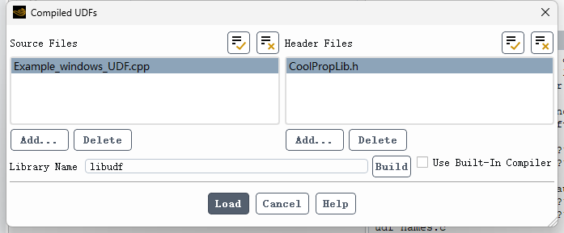
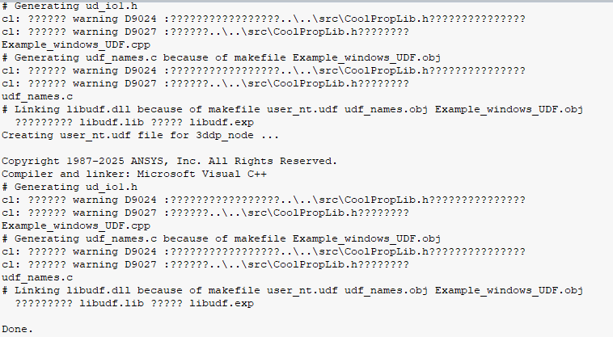
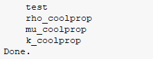
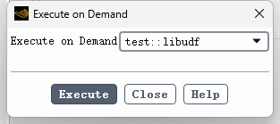

# CoolProp2Fluent
This file describes the steps for compiling CoolProp into Fluent.

Some steps are referred to https://github.com/CoolProp/CoolProp/blob/master/wrappers/Fluent/README.rst

# Windows

1. Download corresponding dependencies `CoolProp.dll、CoolProp.lib、CoolPropLib.h` as https://github.com/lihy213/Coolprop2VS described.
2. Place them to your Fluent working directory.
3. Launch Fluent.
4. Select *User-Defined* tab -> *Functions* -> *Compiled*
5. Add your UDF source file, here refer to `Example_windows_UDF.cpp`
6. Add header file, here refer to `CoolProp.dll` in step 1.
7. 
8. Then click `Build`, ignore the warnings unless there're errors.
9. 
10. Click `Load`.
11. 
12. Test functionality through *User-Defined* tab -> *Excute on Demand* -> select *test::libudf* -> Click Execute
13. 
